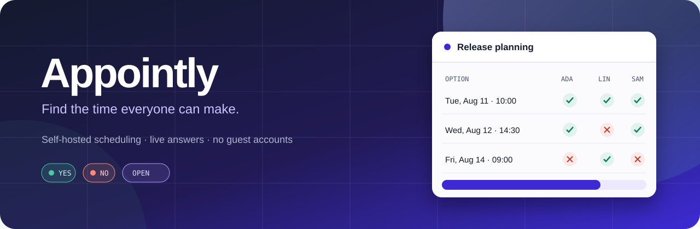
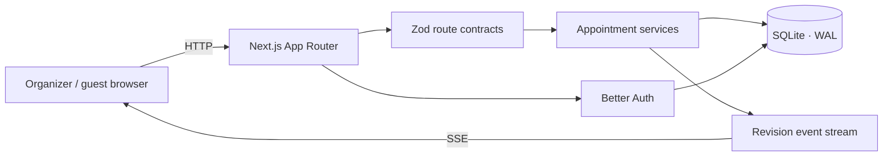

<div align="center">
  

  <br />

  **A self-hosted scheduling board for finding the time everyone can make.**

  Put the options in one place, collect clear answers live, and lock the winner — without making every guest create an account.

  <br />

  [](https://nextjs.org/)
  [](https://www.typescriptlang.org/)
  [](https://www.sqlite.org/)
  [](https://www.docker.com/)
  [](#testing)

  [Quick start](#quick-start) · [Features](#features) · [Configuration](#configuration) · [Architecture](#architecture) · [Deployment](#deployment)
</div>

---

## Why Appointly?

Most scheduling tools either require every participant to register or turn into another long message thread. Appointly keeps the organizer workflow accountable while making the guest workflow deliberately small:

1. **Create** an appointment with possible days, times, or ranges.
2. **Share** one public link.
3. **Collect** Yes/No answers as they arrive in real time.
4. **Finalize** the option that works best.

Guests only need a display name. Their private edit link lets them return and change an answer later.

## Features

| | |
|---|---|
| **Four scheduling shapes** | Whole days, dates with times, date ranges, and date-time ranges. The composer infers the shape from the options entered. |
| **Live shared board** | Server-Sent Events notify every open board when answers or appointment details change. |
| **Account-free guests** | Participants answer from a shared link and receive a private, revocable edit link. |
| **Organizer controls** | Edit details, add options, finalize or reopen, reset guest links, and manage co-organizers. |
| **Two access modes** | Google OAuth for normal deployments, or a shared login-free mode for trusted internal networks and development. |
| **Accessible by design** | Responsive keyboard flows, light and dark schemes, reduced-motion support, axe gates, and platform accessibility-tree tests. |
| **Self-contained storage** | SQLite on local disk, plain SQL migrations, no external database service required. |
| **Production-ready image** | Multi-stage Docker build, standalone Next.js runtime, persistent volume, and healthcheck. |

## Quick start

### Requirements

- [Node.js 24](https://nodejs.org/) — pinned in [`.nvmrc`](.nvmrc)
- npm
- A Google OAuth client **only if Google login is enabled**

```bash
git clone https://github.com/eugen1763/appointly.git
cd appointly
npm ci
cp .env.example .env
```

Generate the two secrets:

```bash
openssl rand -base64 32 | tr '+/' '-_' | tr -d '='
```

Put a different generated value in `BETTER_AUTH_SECRET` and `GUEST_TOKEN_SECRET`, then choose an access mode.

<details open>
<summary><strong>Option A — Google login</strong></summary>

```dotenv
APP_URL=http://localhost:3000
GOOGLE_AUTH_ENABLED=true
GOOGLE_CLIENT_ID=your-client-id
GOOGLE_CLIENT_SECRET=your-client-secret
```

Add this callback URL to the Google OAuth client:

```text
http://localhost:3000/api/auth/callback/google
```

</details>

<details>
<summary><strong>Option B — trusted internal instance, no login</strong></summary>

```dotenv
APP_URL=http://localhost:3000
GOOGLE_AUTH_ENABLED=false
GOOGLE_CLIENT_ID=
GOOGLE_CLIENT_SECRET=
```
</details>

> [!WARNING]
> Login-free mode gives every visitor the same internal organizer identity. Anyone who can reach the instance can see its dashboard and manage appointments owned by that identity. Use it only for local development or on a trusted internal network.

Start the app:

```bash
npm run db:migrate
npm run dev
```

Open [http://localhost:3000](http://localhost:3000).

## Configuration

Every variable is required except Google credentials when login is disabled.

| Variable | Purpose |
|---|---|
| `APP_URL` | Canonical origin used for OAuth callbacks, public links, and exact-origin checks on mutating requests. |
| `BETTER_AUTH_SECRET` | Base64url secret of at least 32 bytes used to sign organizer sessions. |
| `GUEST_TOKEN_SECRET` | Separate base64url secret used for guest edit links. Rotating it invalidates outstanding guest links. |
| `GOOGLE_AUTH_ENABLED` | `true` by default. Set `false` to use the shared internal organizer without login. |
| `GOOGLE_CLIENT_ID` | Google OAuth client ID; required when Google login is enabled. |
| `GOOGLE_CLIENT_SECRET` | Google OAuth client secret; required when Google login is enabled. |
| `DATABASE_PATH` | Writable SQLite file path. The example uses `./data/appointly.sqlite`. |
| `TRUST_PROXY` | Set `true` only behind a reverse proxy that supplies trusted `X-Forwarded-*` headers. |

The production Google callback is `${APP_URL}/api/auth/callback/google`.

## How scheduling works

### Appointment shapes

An appointment has one shape, fixed at creation. Every option is therefore directly comparable:

- `DATE` — individual calendar days
- `DATE_TIME` — individual instants
- `DATE_RANGE` — inclusive runs of calendar days
- `DATE_TIME_RANGE` — start/end instants

Options are stored as calendar dates or UTC instants depending on their shape. The interface renders timed options in the viewer's time zone.

### Guests and edit links

Anyone with the public appointment link can join with a display name. Appointly returns a private edit link once; the guest can use it later to change answers. An organizer can revoke and reissue that link.

### Organizers and co-organizers

The creator owns the appointment. Co-organizers are invited by email and gain manager rights when they first sign in with that address. Only the owner can delete an appointment or change its co-organizer list.

### Live updates

The Server-Sent Events stream carries only a revision number. A client that sees a newer revision fetches a fresh validated snapshot. Response controls update optimistically and roll back if the server rejects the write.

### Routes and limits

| Route | Purpose |
|---|---|
| `/` | Landing page and primary organizer entry point |
| `/dashboard` | Owned and co-organized appointments, tallies, leaders, and composer |
| `/appointments/new` | Full-page appointment composer |
| `/a/[publicId]` | Public board for answering, results, editing, and finalizing |
| `/a/[publicId]/edit#…` | Redeems a private guest edit token, then returns to the board |
| `/api/health` | Returns `{"status":"ok"}` |

Limits: **1–100 options** per appointment (default 10), **200 participants**, **20 co-organizers**, 120 title characters, 2,000 description characters, and 80 display-name characters.

## Architecture



The app uses React Server Components by default and client components only where interaction requires them. CSS Modules sit on a shared token system in `src/app/globals.css`, allowing light and dark themes to use the same component rules.

```text
src/
├── app/                         routes, API handlers, route-scoped UI
│   ├── a/[publicId]/            public appointment board
│   ├── api/appointments/        HTTP surface
│   └── _components/             shared shell components
├── features/appointments/
│   ├── contracts.ts             request, response, and error schemas
│   └── server/                  database-backed application services
├── db/                          Drizzle schema and SQLite connection
└── lib/                         auth, security, email, return paths
e2e/                             Playwright specifications
drizzle/                         plain SQL migrations
```

Two boundaries keep the codebase predictable:

- **`contracts.ts` is authoritative.** Routes and E2E tests validate against the same request, response, actor, and error definitions.
- **Route handlers are factories.** Production files inject the database, session readers, clocks, and token digesters, while tests invoke handlers without starting a server.

### Storage constraints

SQLite runs in WAL mode, so Appointly expects **one application instance on local disk**. Do not run multiple replicas against the same file or place it on a network filesystem.

## Testing

```bash
npm run typecheck
npx vitest run --exclude 'e2e/**'
npm run test:e2e
```

The suite contains **1,160+ unit tests** and **22 end-to-end tests**. Playwright runs serially against a disposable SQLite database. Its fixture-only email/password auth requires both `E2E_AUTH=1` and a non-production `NODE_ENV`, so it cannot be enabled in production.

Accessibility is a gate rather than a manual assumption: axe runs across every route in both color schemes and viewport sizes, and the board suite also inspects Chromium's platform accessibility tree.

> [!NOTE]
> The package's broad `npm test` command also discovers Playwright files, which Vitest cannot execute. Use the explicit unit command above when you want a clean unit-only run.

## Deployment

```bash
docker compose -f compose.yaml -f compose.production.yaml up -d --build
```

The multi-stage image produces a standalone Next.js server. Compose mounts the SQLite database in the `appointly-data` volume and checks `/api/health`.

> [!IMPORTANT]
> **Back up SQLite through SQLite.** WAL mode means copying only `appointly.sqlite` can miss committed data still present in the write-ahead log. Use:
>
> ```bash
> sqlite3 /path/to/appointly.sqlite ".backup /path/to/backup.sqlite"
> ```

The production build currently needs egress to `fonts.googleapis.com`: `next/font` downloads Archivo and IBM Plex Mono at build time and self-hosts them in the resulting image. For an air-gapped build, vendor the font files and switch `src/app/layout.tsx` to `next/font/local`.

Migrations are plain SQL under `drizzle/`. `npm run db:generate` creates a migration from the schema; `npm run db:migrate` applies pending migrations.

## Project status

Appointly is usable and thoroughly tested, but still evolving. [`OPEN-POINTS.md`](OPEN-POINTS.md) records known limitations, deliberately deferred work, and implementation traps worth reading before a larger contribution.

If you find a bug or have an idea, [open an issue](https://github.com/eugen1763/appointly/issues).
